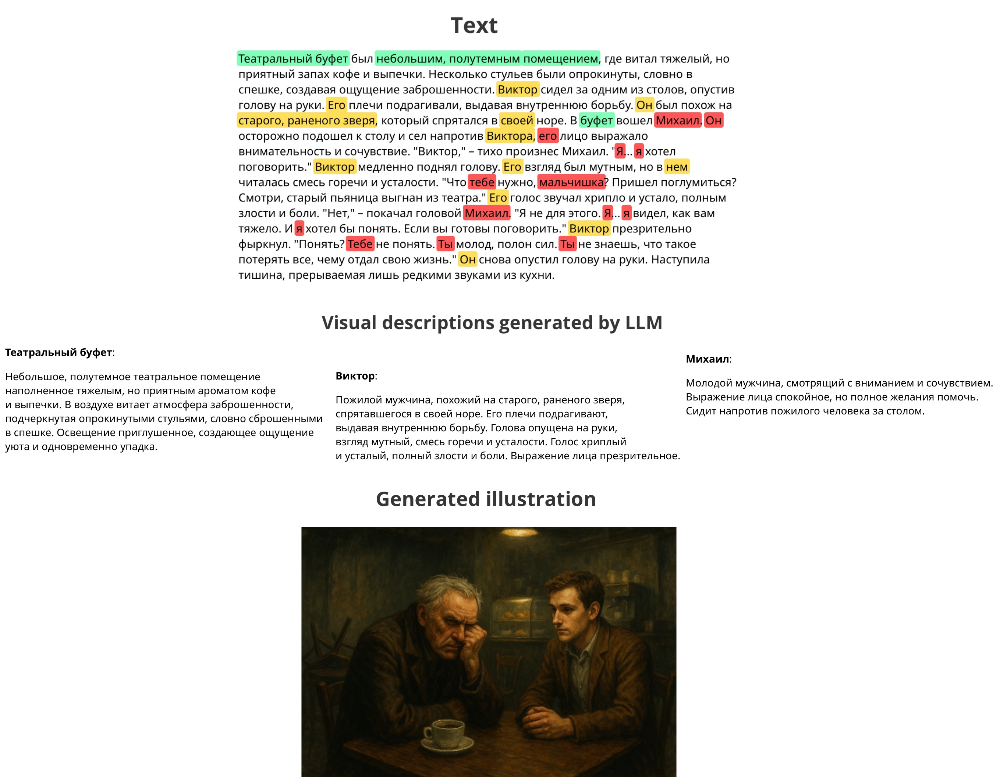

# Illustory: An NLP Pipeline for Extracting Visual Descriptions

This project proposes an NLP pipeline designed for the automatic extraction of detailed visual descriptions of entities (characters, locations) from Russian literary texts. The ultimate goal is to create prompts for text-to-image models to generate illustrations for books.

## Pipeline Architecture

1. **Preprocessing**: The text is cleaned of artifacts (e.g., headings, footnotes) and parsed into the CoNLL-U format using `UDPipe`.  
2. **Coreference Resolution**: A modified `CorPipe` model identifies all entity mentions in the text.  
3. **Long-Distance Cluster Merging**: The custom `clusterer.py` module analyzes and merges clusters that refer to the same entity but were separated due to the model’s limited context window.  
4. **Sentence Classification**: A fine-tuned `ruBERT-base` model filters sentences containing visual descriptions of each entity.  
5. **Final Description Generation**: A LoRA fine-tuned LLM, `T-lite-it-1.0`, aggregates filtered sentences into a coherent visual description.

## Example

Here you can see how illustory extracts all entity mentions in the text, and generates visual discriptions for text-to-image generative model.



[//]: # (## Installation and Usage)

[//]: # ()
[//]: # (1. **Install dependencies:**)

[//]: # (    ```bash)

[//]: # (    pip install -r requirements.txt)

[//]: # (    ```)

[//]: # ()
[//]: # (2. **Download necessary models:**)

[//]: # (    ```bash)

[//]: # (    bash scripts/udpipe_setup.sh)

[//]: # (    ```)

[//]: # (   )
[//]: # (3. **Run the pipeline:**)

[//]: # (    ```bash)

[//]: # (    ```)

## Project Structure

```
.
├── src/                      # Main source code for pipeline orchestration
│   └── after_coref/          # Scripts for post-processing after coreference
│       ├── sentence_classifier.py # Sentence classifier
│       └── generate_prompts.py    # Fine-tuning/logic for description generation
│
├── long-corpipe/             # Adapted Coreference Resolution model
│   ├── corpipe24.py          # Modified core CorPipe model script
│   └── clusterer.py          # Custom module for merging entity clusters
│
├── notebooks/                # Book dataset analysis (EDA) and text preprocessing scripts
```